# ut-hdfs-linux
Universal Automation Center support for HDFS

# 1.	Disclaimer

No support and no warranty are provided by Stonebranch GmbH for this document and the related Universal Task. The use of this document and 
the related Universal Task is on your own risk.

Before using this task in a production system, please perform extensive testing.

Stonebranch GmbH assumes no liability for damage caused by the performance of the Universal Tasks

# 2.	Scope 

This document provides a documentation how to install and use the Universal Tasks for HDFS Storage File Transfers. If more Task will be 
created in the future this document will be updated accordingly.  

# 3.	Introduction

Storing data in a Hadoop file system becomes an integral part of most modern bigdata IT landscapes. With Universal Automation Center you 
can securely automate your AWS, Azure, Google or HDFS File Transfers and integrate them into your existing scheduling flows.
The here described Series of Universal Tasks focuses on HDFS file transfer. A similar solution as HDFS is also available for Amazon S3, 
Google GCS or Azure Blob storage. 

Some details about the universal tasks for HDFS:

    •	The Universal Task uses the Python hdfs module, which calls the Hadoop WebHDFS REST API   
    •	The Universal Task supports both Universal Agent for Linux/Unix and Windows however it has been currently only tested against a Linux Agent
    •	You can select different log-levels e.g. Info and debug
    •	All Passwords are encrypted using Controller Credentials
    •	Currently only the InsecureClient (the default) is implemented the TokenClient can be implemented on request
    
The following Universal Tasks for Google Blob Storage have been implemented: 

Image 1:

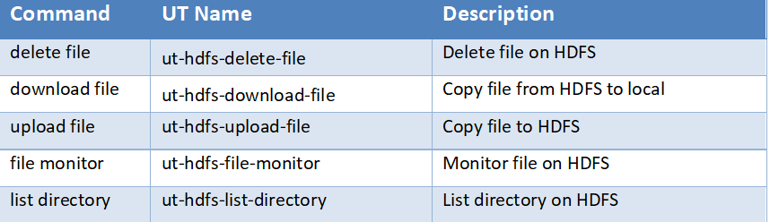

# 4	Installation
# 4.1	Software Requirements for Linux Agent
**Universal Task name:** ut-hdfs-linux
**Related UAC XML Files for template and task:** Github repository
**Requirements:**

    •	Python 3.6
    •	For Python the following modules are required: 
    •	os, for linux command execution
    •	datetime and time to compare file timestamps
    •	hdfs to perform the hdfs file operations
    •	logging, for python loglevel support
          Note: Only the module hdfs needs to be added via python installer
                •	pip install hdfs 
    •	Universal Controller V6.4.7.0 or higher
    •	Universal Agent V6.5.0.0 or higher installed on a Linux Server
    
# 4.2	Installation Steps

The following describes the installation steps:

**1.	Check the current Python Version**

    python -V  (Note: Captial “V”)

If your Version is Python 3.6 or later all is fine. If a no python or a lower Version has been installed upgrade your python Version or 
install the Universal Agent with the Python binding option (--python yes). This option will install python 3.6. along with your 
universal agent.

e.g.

    sudo sh ./unvinst --network_provider oms --oms_servers 7878@192.168.88.12 --oms_port 7878 --oms_autostart no --ac_netname 
    OPSAUTOCONF --opscli yes --python yes

**2.	Add the required python modules**

In a command shell run as sudo or root:

    •	For Python the following modules are required: 
    •	pip install hdfs
        or in case of universal Agent with python binding: 
            /opt/universal/python3.6/bin/python3 -m pip install hdfs
     Only run these if not available already:
    •	pip install datetime
    •	pip install logging
    •	pip install os

**Note:**

It is assumed that the modules logging, sys, datetime, os are already available. If not install them via pip. Only the module hdfs is 
usually not part of your installation.

    https://support.microsoft.com/en-us/help/2977003/the-latest-supported-visual-c-downloads#bookmark-vs2013 

**3.	Import each hdfs Universal Task including the Universal Template to your Controller**

Go to “All Tasks” and load via the Import functionality the Universal Tasks configuration into the Controller. 

Image 2:

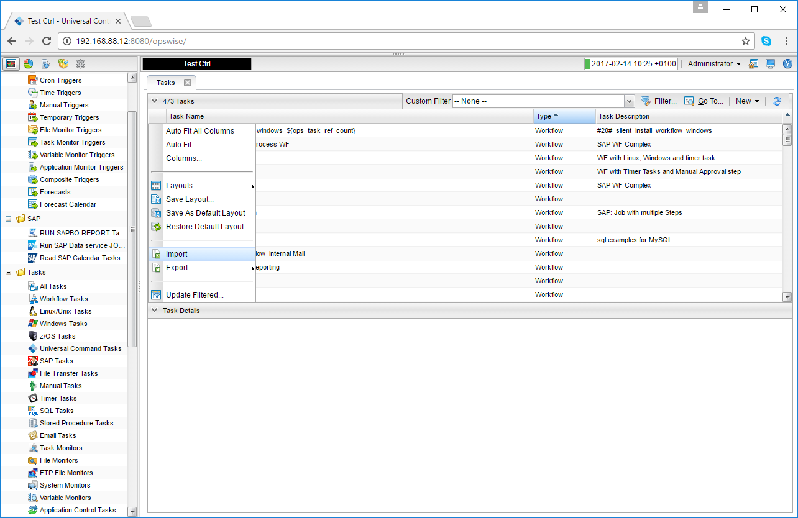

Image 3:

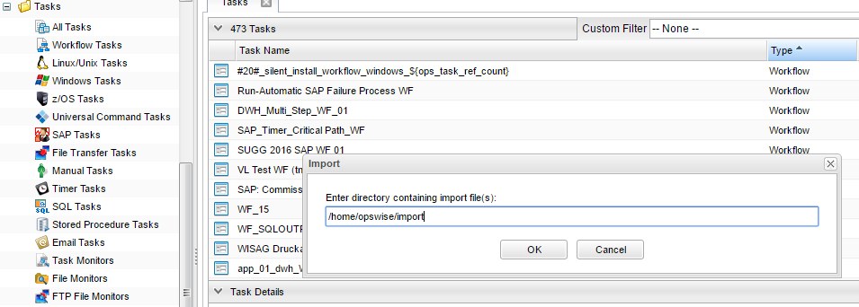

# 5	Universal Task Configuration

**1.	Activate: Resolvable Credentials in Universal Automation Center properties:**

Image 4:

**2.	Fill Out each hdfs Universal Task e.g. Universal Task for hdfs file monitoring:**

Image 5:

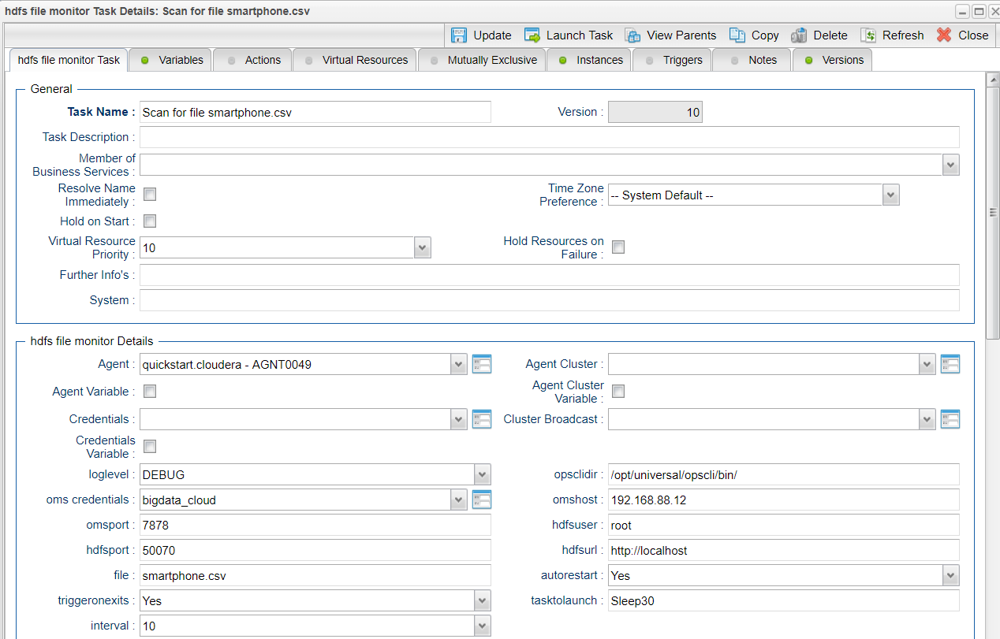

**Credential for Universal Task:**

Image 6:

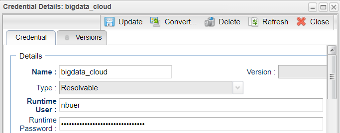

# 6	Universal Tasks for HDFS file system

The following chapter describes the provided HDFS Storage Universal Tasks.

# 6.1	Hdfs file monitor

Image 7:

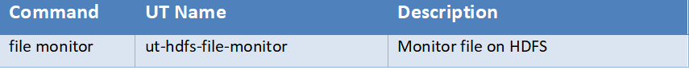

**Task Screenshot:**

Image 8:

**Field Description:**

Image 9:

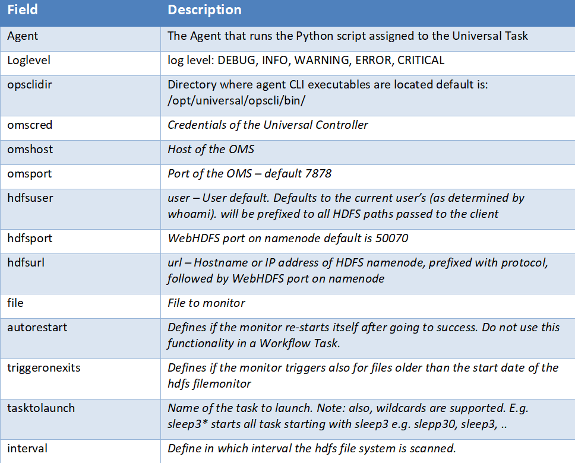

# 6.2	Hdfs file delete file

Image 10:

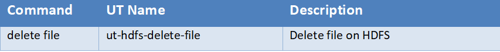

**Task Screenshot:**

Image 11:

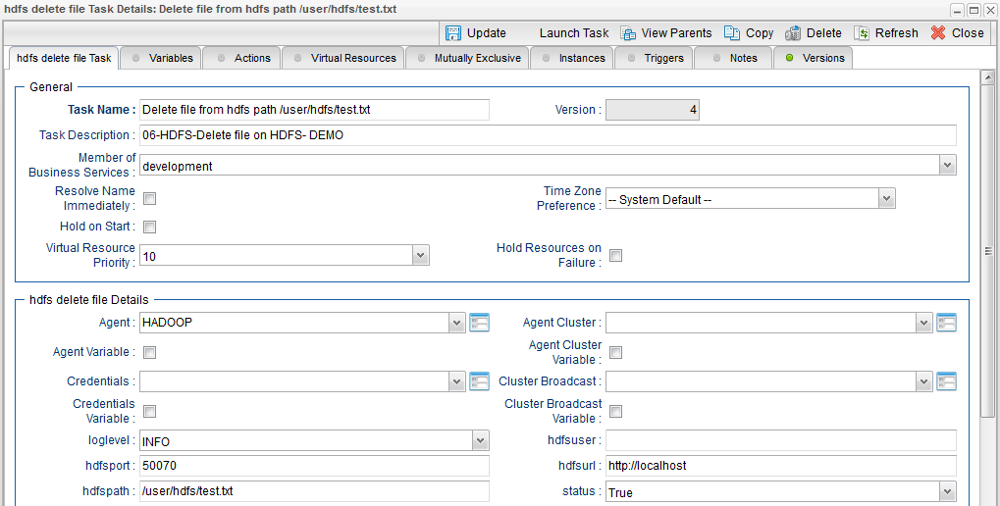

**Field Description:**

Image 12:

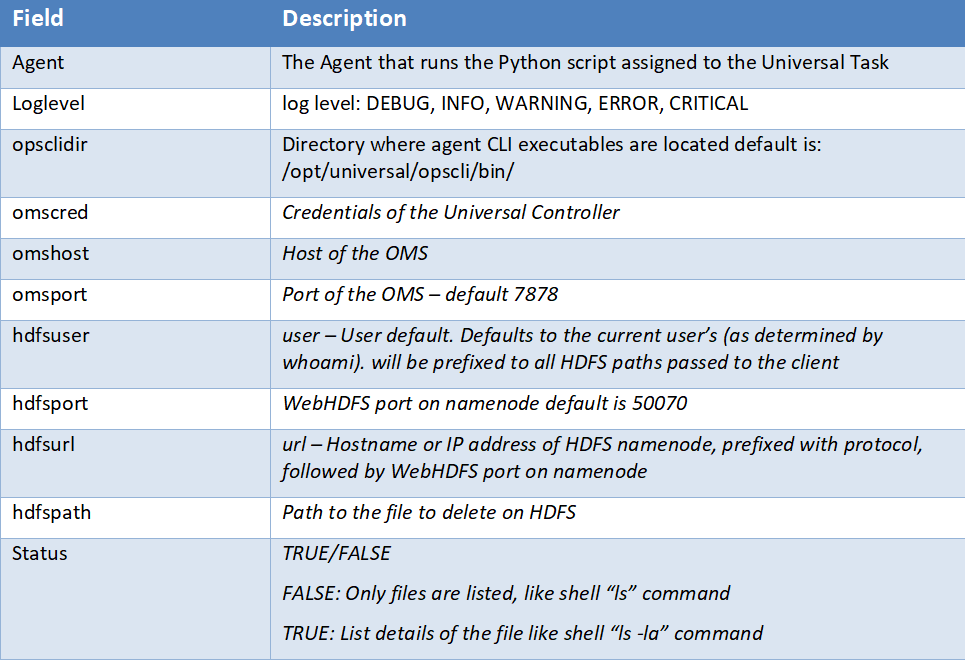

# 6.3	Hdfs download file

Image 13:

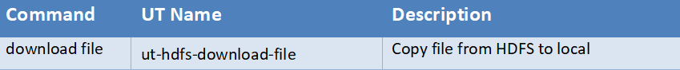

**Task Screenshot:**

Image 14:

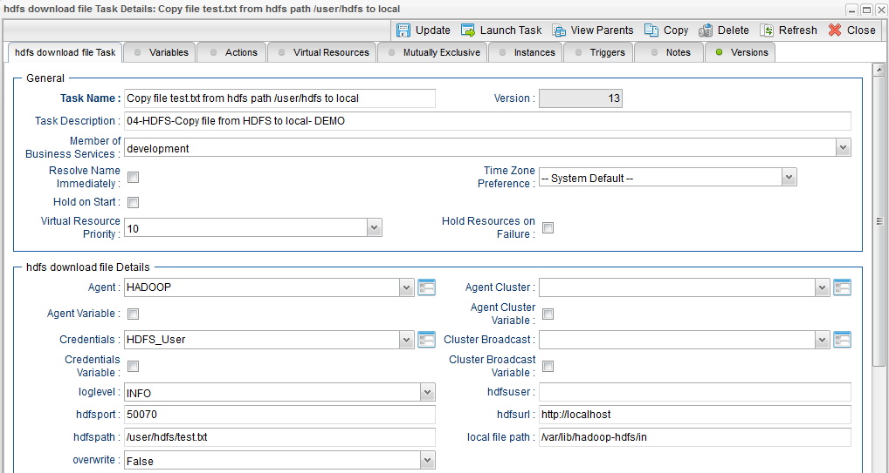

**Field Description:**

Image 15:

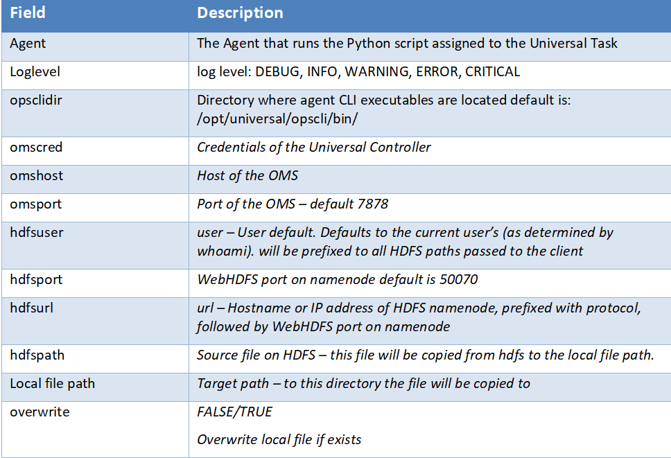

# 6.4	Hdfs upload file

Image 16:

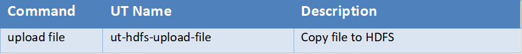

**Task Screenshot:**

Image 17:

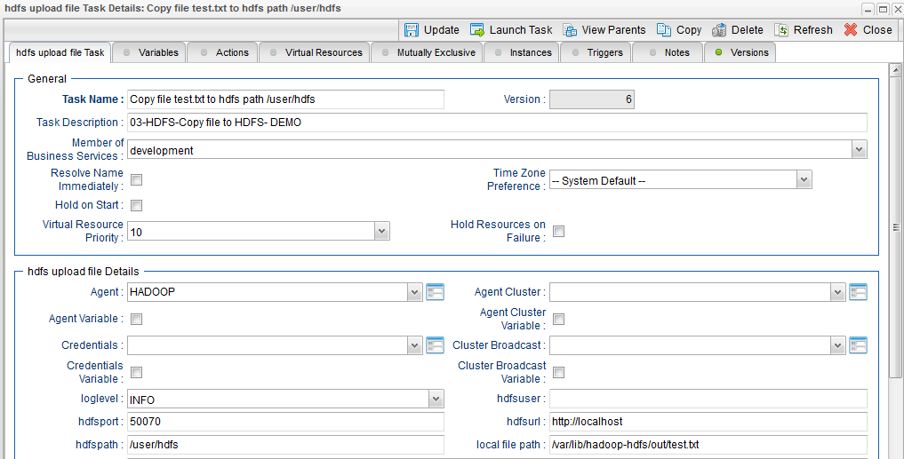

**Field Description:**

Image 18:

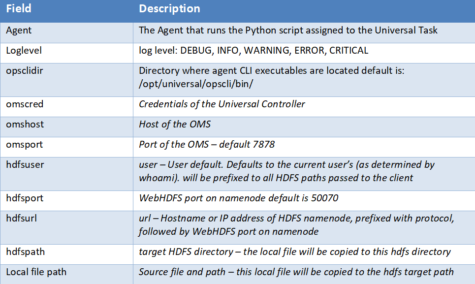

# 6.5	Hdfs list directory

Image 19:

**Task Screenshot:**

Image 20:

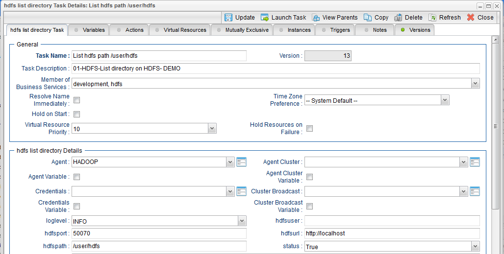

**Field Description:**

Image 21:

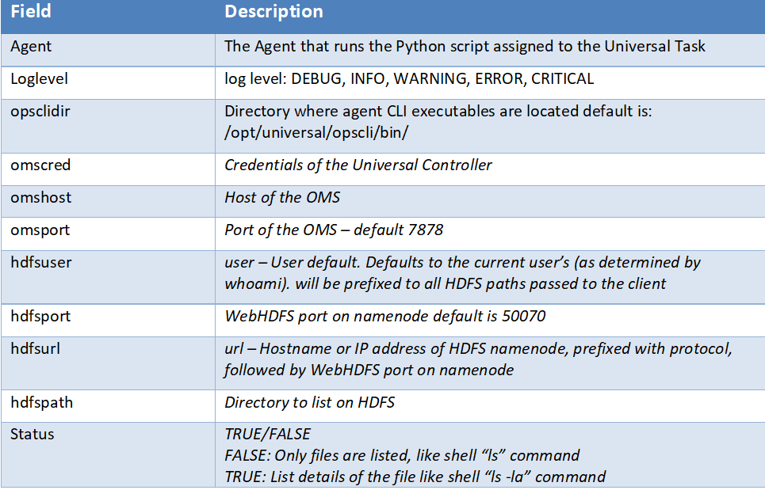

# 7 Test case

Image 22

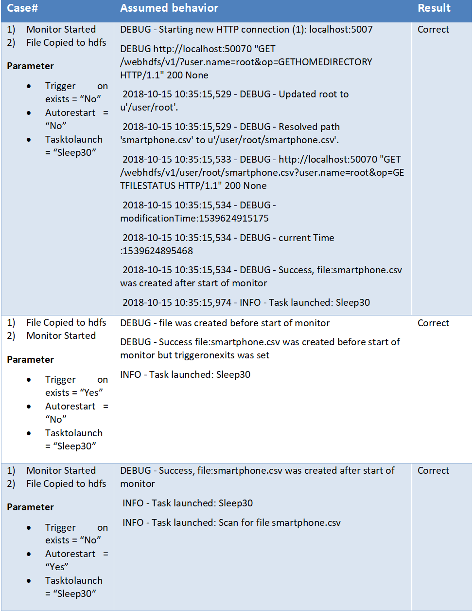

Image 23

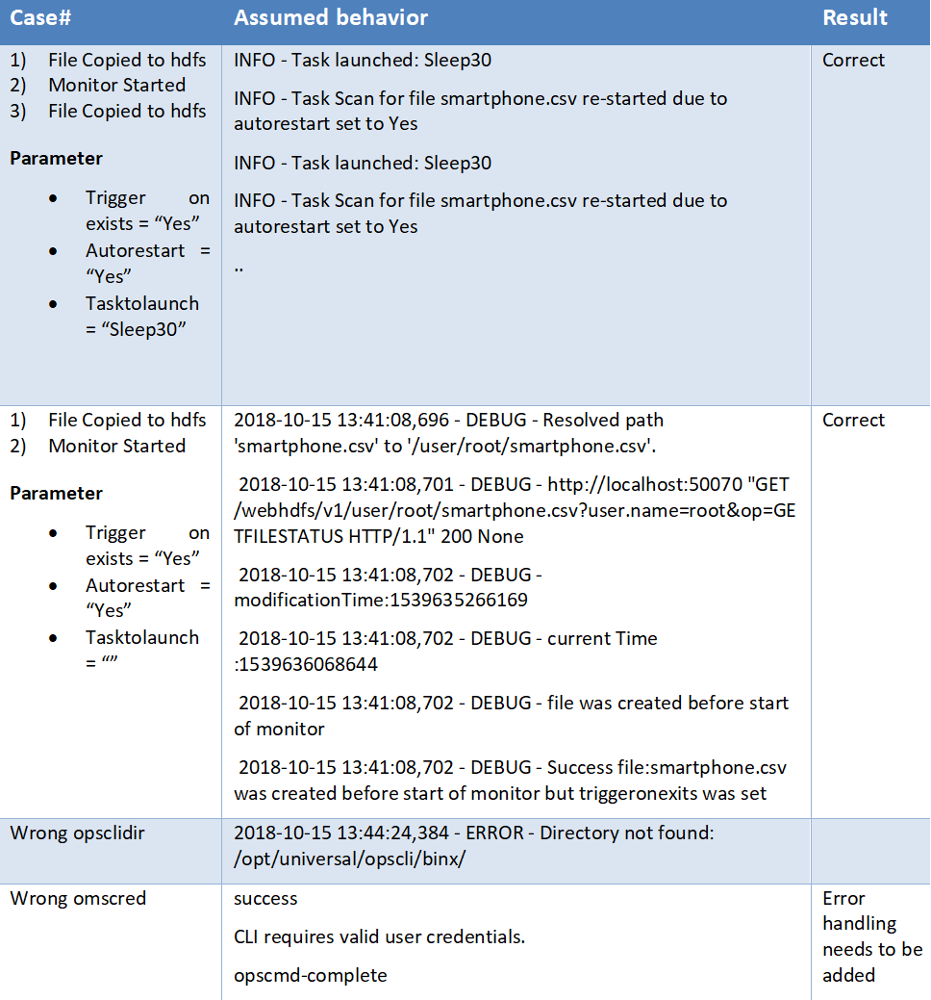

Image 24

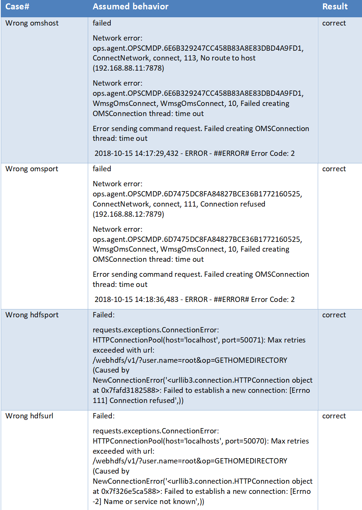

# 8	Document References

This document references the following documents:

Image 25

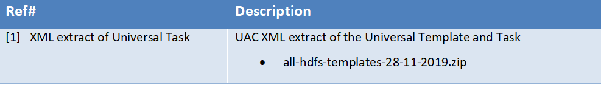
